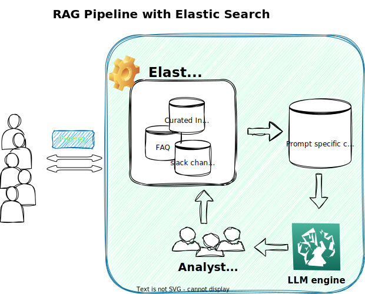

### Short description of the files:
* [Preparing the documents](modify_doc.py)
* [Searching via basic search aka. minisearch](min_search.py)
* [Searching via Elastic search](elastic_search.py)
* [Creating a prompt with the context for Open AI](prompt_building.py)
* [Connecting to Open AI client and executing the query](open_ai_prompt.py)
  * [Connecting to Gemini client and executing the query](gemini_api.py)
* [Wrapping everything in the RAG pipeline](RAG_pipeline.py)

### eg. of execution: 
* Make sure that ElasticSearch is running via Docker:
```bash
docker run -it \
    --rm \
    --name elasticsearch \
    -p 9200:9200 \
    -p 9300:9300 \
    -e "discovery.type=single-node" \
    -e "xpack.security.enabled=false" \
    docker.elastic.co/elasticsearch/elasticsearch:8.4.3
``` 

* Run RAG_pipeline.py
```bash
python RAG_pipeline.py \
    --document documents.json \
    --query "How do I execute a command in a running docker container?" \
    --course machine-learning-zoomcamp
```